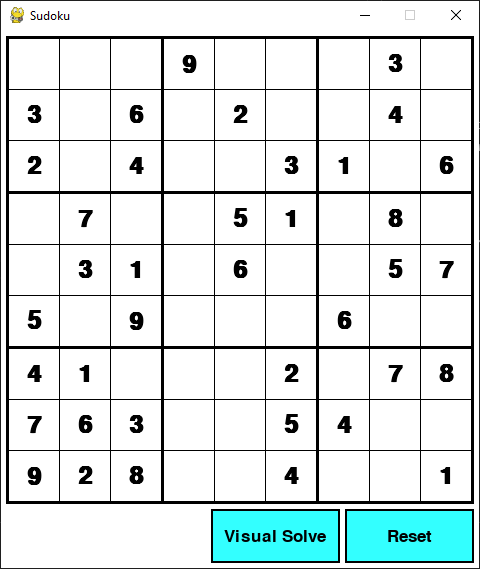
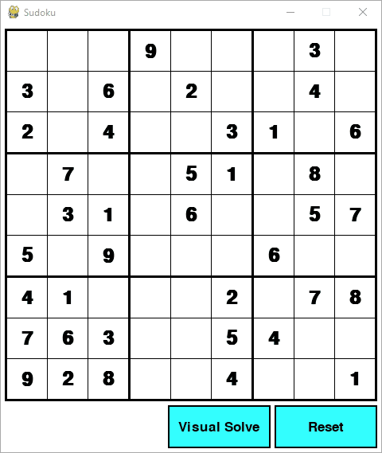
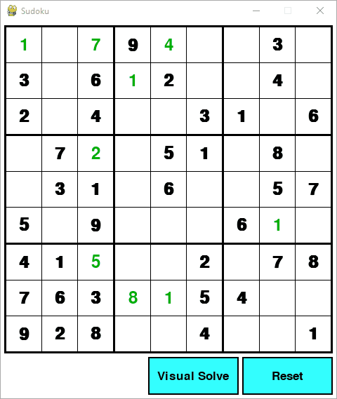
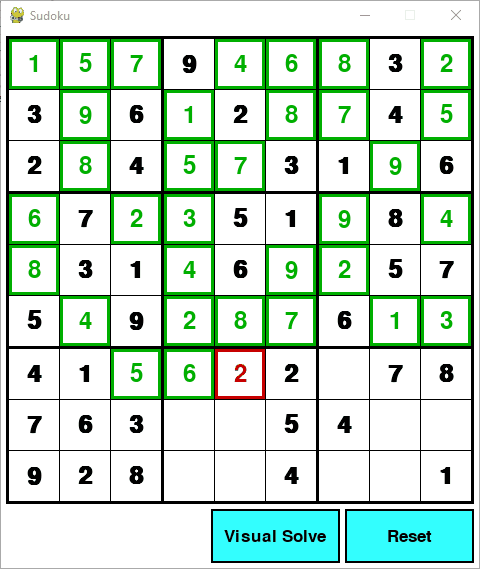

# pygame-sudoku
> Playable GUI of Sudoku built in Python using Pygame.

`pygame-sudoku` provides a GUI that allows user to play Sudoku. The board is a set board that can only be changed through the `sudoku.py` file.

## Download
All of the following instructions assumes that the user already has a valid version of Python 3.6+ and pip installed.<br>
To download the game onto your personal computer:
```
git clone https://github.com/Kistler21/pygame-sudoku.git
```
To downlaod all neccessary python packages:
```
pip install -r requirements.txt
```

## Usage
### Run the game:
**Windows:**
```
py sudoku.py
```
**Linux/macOS:**
```
python3 sudoku.py
```
<br>
### Make a move:
Click on a cell without a default value which will highlight the cell. Then simply enter a number with your keyboard. The number will show up as green if the move is a valid move based on the current numbers on the board or red if the move conflicts with an existing number. Note that a green number does not necessarily mean that the inputted number is the correct value for that cell. It simply means it is valid move based on the current board. Deleting a move can be done by pressing the Backspace or Delete key on a highlighted cell.<br>

### Reset the board:
The Reset button in the game will reset the board back to the staring position.<br>

### Solve the board:
The Visual Solve button in the game will attempt to solve the baord from the current postion while also giving a visualization of the backtracking algorithm being used for the solver.<br>

<br>
If the board is unsolvable, the board will go back to the state it was before the button was pressed.<br>
<br>
